# A/B Testing Implementation for Bangalore Home Price Prediction

This document explains our comprehensive A/B testing system that enables safe, data-driven model deployments with automatic promotion and rollback capabilities.

## Overview

Our A/B testing framework allows us to:
- **Split traffic** between production and candidate models
- **Collect user feedback** on prediction accuracy
- **Monitor performance metrics** (accuracy + latency)
- **Automatically promote** better models
- **Rollback** underperforming candidates

## Architecture

```mermaid
graph TB
    User[👤 User] --> Frontend[🌐 Frontend]
    Frontend --> Router[🔀 Nginx Router]
    
    Router -->|80%| ProdAPI[🟢 Production API<br/>price_check_BO3]
    Router -->|20%| CandAPI[🟡 Candidate API<br/>price_check_CO2]
    
    ProdAPI --> S3Prod[📦 S3: models/price_check_BO3/]
    CandAPI --> S3Cand[📦 S3: models/price_check_CO2/]
    
    ProdAPI --> DB[(🗄️ PostgreSQL)]
    CandAPI --> DB
    
    DB --> Airflow[⚙️ Airflow DAG]
    Airflow -->|Promote| S3New[📦 S3: models/price_check_BO4/]
    Airflow -->|Rollback| S3Cand
```



## Components

### 1. Traffic Splitting (Nginx Router)

**Location**: `router/nginx.conf`

```nginx
# Hash-based traffic splitting for consistency
split_clients $request_id $variant {
    80%     prod;
    20%     cand;
    *       prod;
}

location /api/ {
    if ($variant = "cand") {
        proxy_pass http://infer-cand:6002;
    }
    proxy_pass http://infer-prod:6001;
}
```

**Benefits**:
- ✅ **Deterministic**: Same user gets same variant
- ✅ **Configurable**: Easy to adjust split ratios
- ✅ **Lightweight**: No application-level logic needed

### 2. Model Versioning System

**Location**: `dags/version_utils.py`

Our versioning scheme:
- **Datasets**: `train_V1.csv`, `train_V2.csv`, `train_V3.csv`...
- **Best Models**: `price_check_BO1/`, `price_check_BO2/`, `price_check_BO3/`...
- **Candidate Models**: `price_check_CO1/`, `price_check_CO2/`, `price_check_CO3/`...

**Key Functions**:
```python
get_latest_dataset_version()     # Returns highest train_V{n}
get_latest_model_version('BO')   # Returns highest price_check_BO{n}
get_next_model_version('CO')     # Returns next price_check_CO{n+1}
promote_candidate_to_best()      # CO{n} → BO{n+1}
```

### 3. Request Logging & User Feedback

**Database Schema**:
```sql
-- Every prediction is logged
CREATE TABLE prediction_logs (
    id SERIAL PRIMARY KEY,
    ts TIMESTAMP WITH TIME ZONE,
    variant TEXT,                    -- 'price_check_BO3' or 'price_check_CO2'
    location TEXT, sqft FLOAT, bhk INT, bath INT,
    prediction FLOAT,
    prediction_time_ms FLOAT,        -- Latency tracking
    session_id TEXT, user_ip TEXT
);

-- User feedback collection
CREATE TABLE user_feedback (
    id SERIAL PRIMARY KEY,
    prediction_id INTEGER REFERENCES prediction_logs(id),
    feedback_type TEXT,              -- 'rating', 'accurate', 'too_high', 'too_low', 'actual_price'
    feedback_value FLOAT,            -- 1-5 rating or actual price
    feedback_text TEXT,              -- Optional comments
    feedback_ts TIMESTAMP DEFAULT NOW()
);
```

**Frontend Feedback UI**:
- ⭐ **Star ratings** (1-5) for accuracy
- 🎯 **Quick buttons** (Accurate, Too High, Too Low)
- 💰 **Actual price input** for ground truth
- 💬 **Comments** for qualitative feedback

### 4. Candidate Model Generation (now inline)

**Location**: `dags/bangalore_home_prices_dag.py`

The unified pipeline DAG now handles *both* production (BO) and candidate (CO) training.

Logic summary:
1. **Detect model type** at runtime:  
   • If no BO model exists yet → train `price_check_BO1`.  
   • If a BO exists **and** no pending candidate CO is present → train next `price_check_CO{n+1}` using the latest dataset `train_V{m}`.
2. After a candidate is saved to S3 the DAG:
   1. Restarts the `infer-cand` container (`docker compose restart infer-cand`) so the API picks up the new model.
   2. Triggers `evaluate_ab_dag` to start the A/B evaluation cycle.
3. The dedicated `generate_candidate_dag.py` has been removed—maintenance is simpler and timing is guaranteed.

### 5. Performance-Based Evaluation

**Location**: `dags/evaluate_ab_dag.py`

**Schedule**: Hourly analysis

**Decision Matrix**:

| Metric | Weight | Promotion Threshold | Rollback Threshold |
|--------|--------|-------------------|-------------------|
| **User Rating** | 70% | 10% improvement | 20% degradation |
| **Latency** | 30% | 20% faster | 2x slower |
| **MAE** (if available) | Bonus | 10% better | - |

**Composite Scoring**:
```python
# Normalize metrics (0-1 scale)
accuracy_score = rating / 5.0
latency_score = max(0, (5000 - latency_ms) / 5000)

# Weighted composite
composite_score = accuracy_score * 0.7 + latency_score * 0.3

# Promote if 5% better composite score
if candidate_composite > production_composite + 0.05:
    return "promote"
```

**Safety Checks**:
- 🛡️ **Minimum traffic**: Require 50+ candidate requests
- 🛡️ **Minimum feedback**: Need 10+ user ratings
- 🛡️ **Maximum duration**: Auto-rollback after 7 days
- 🛡️ **Performance degradation**: Immediate rollback if significantly worse

## A/B Testing Workflow

### Phase 1: Candidate Generation
1. **Main DAG** (`bangalore_home_prices_dag`) detects need for a new candidate.  
2. It trains on the **latest dataset** version (`train_V{n}`) with tuned hyperparameters.  
3. Saves artefacts to **`price_check_CO{n+1}`** and restarts the `infer-cand` container.  
4. Immediately triggers **`evaluate_ab_dag`** for automated evaluation.

### Phase 2: Traffic Split
1. **Nginx router** splits traffic 80/20
2. **Production backend** loads `price_check_BO{latest}`
3. **Candidate backend** loads `price_check_CO{latest}`
4. Both log requests with **variant identifier**

### Phase 3: Data Collection
1. **Every prediction** logged with latency
2. **User feedback** collected via frontend UI
3. **Session tracking** for user experience analysis
4. **Performance metrics** calculated in real-time

### Phase 4: Automated Decision
1. **Hourly evaluation** DAG runs
2. **Compares metrics** between variants
3. **Decision logic**:
   - **Promote**: If candidate significantly better
   - **Rollback**: If candidate significantly worse
   - **Continue**: If performance similar (up to 7 days)

### Phase 5: Model Promotion
1. **Copy candidate** to new best version (`CO2` → `BO4`)
2. **Restart production** container to load new model
3. **Log promotion** event for audit trail

## Example A/B Test Scenario

### Initial State
- **Production**: `price_check_BO3` (Ridge α=1.0, avg rating: 4.0, latency: 250ms)
- **Candidate**: `price_check_CO2` (RandomForest, avg rating: 4.2, latency: 200ms)

### After 1 Week
```
Production Metrics (BO3):
  - Requests: 800 (80% of 1000)
  - Avg Rating: 4.0/5
  - Avg Latency: 250ms
  - MAE: 11.5 lakhs

Candidate Metrics (CO2):
  - Requests: 200 (20% of 1000)  
  - Avg Rating: 4.2/5 (+5% better)
  - Avg Latency: 200ms (20% faster)
  - MAE: 10.8 lakhs (6% better)

Composite Scores:
  - Production: (4.0/5)*0.7 + (4750/5000)*0.3 = 0.845
  - Candidate: (4.2/5)*0.7 + (4800/5000)*0.3 = 0.876
  
Decision: PROMOTE (3.7% improvement > 5% threshold? No, but faster + better rating)
```

### Promotion Result
- **New Production**: `price_check_BO4` (RandomForest model)
- **Next Candidate**: `price_check_CO3` (ElasticNet, generated next week)

## Monitoring & Observability

### Key Metrics Tracked
1. **Traffic Distribution**: Actual vs expected split ratios
2. **Conversion Rates**: User engagement with predictions
3. **Feedback Rates**: % of users providing ratings
4. **Model Performance**: Accuracy, latency, error rates
5. **Business Impact**: User satisfaction trends

### Alerts & Notifications
- 🚨 **High error rates** in either variant
- 🚨 **Significant latency spikes**
- 🚨 **Low feedback collection rates**
- ✅ **Successful promotions**
- ⚠️ **Automatic rollbacks**

## Benefits Achieved

### For Users
- ✅ **Better predictions** through continuous improvement
- ✅ **Faster responses** via latency optimization
- ✅ **Transparent feedback** mechanism

### For Data Scientists
- ✅ **Safe experimentation** with automatic rollbacks
- ✅ **Data-driven decisions** based on real user feedback
- ✅ **Continuous learning** from production traffic

### For Operations
- ✅ **Zero-downtime deployments**
- ✅ **Automated model lifecycle**
- ✅ **Comprehensive audit trail**

## Future Enhancements

### Short Term
- [ ] **Slack notifications** for promotion/rollback events
- [ ] **Grafana dashboard** for real-time metrics
- [ ] **Multi-armed bandit** for dynamic traffic allocation

### Long Term
- [ ] **Multi-model ensembles** as candidates
- [ ] **Geographical A/B testing** (different models per region)
- [ ] **Personalized models** based on user behavior
- [ ] **External model APIs** integration (third-party services)

## Conclusion

Our A/B testing system provides a robust, automated approach to model deployment that:
- **Minimizes risk** through gradual rollouts and safety checks
- **Maximizes learning** through comprehensive feedback collection
- **Optimizes performance** by balancing accuracy and speed
- **Scales efficiently** with minimal manual intervention

This foundation enables continuous model improvement while maintaining production stability and user trust.
